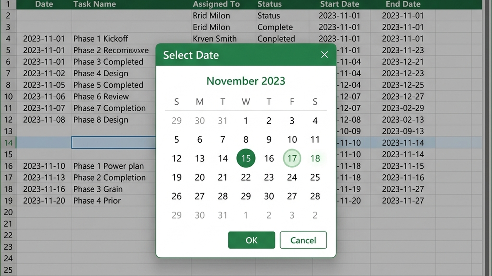

# Excel Quick Date Picker (VBA Calendar Add-in) 📅

A lightweight, modern, and highly customizable Microsoft Excel Add-in (`.xlam`) providing an interactive graphical calendar dialog box (Calendar Form). Written entirely in VBA (Visual Basic for Applications), it allows users to double-click any cell to pick a date from a clean UI instead of typing dates manually.

---

## 🌟 Key Features

*   **Modern Calendar Interface:** An intuitive and user-friendly dialog form supporting easy selection of days, months, and years.
*   **Double-Click Activation:** Automatically displays the calendar popup when double-clicking specified input cells.
*   **Advanced Theme Customization:** Fully customize colors (Header background, fonts, hover states, selection states, Saturdays, and Sundays) using RGB parameters.
*   **Flexible Config Options:**
    *   Toggle Week Number display (ISO week numbers).
    *   Show/Hide the "Today" shortcut button and "Okay" confirmation button.
    *   Auto-detects pre-existing dates in the selected cell and highlights them as default.
*   **Lightweight & Secure:** 100% offline execution. Tightly integrates into Excel as a global add-in without bloating your workbooks.

---

## 🖥️ Preview



---

## 📘 Detailed End-User Guide & Explanation

This Excel add-in eliminates the hassle of manually typing dates—which often leads to typing errors or incorrect date formatting (`dd/mm/yyyy` vs `mm/dd/yyyy`). 

### 1. Opening the Date Picker via Keyboard Shortcut
Once the add-in is installed:
*   Select any cell in Excel and press **`Ctrl + \``** (Control + Backtick key, located right below the `Esc` key and to the left of the `1` key).
*   The interactive calendar window will pop up at the cell position.
*   Select your desired date and click **OK** (or double-click the date). The chosen date is written to the cell in the standard `dd/mm/yyyy` format.

### 2. Auto-Highlighting Pre-existing Dates
If the selected cell already contains a date (e.g. `20/09/2026`), the calendar will automatically launch displaying September 2026 with the 20th day highlighted. This allows you to quickly adjust dates without starting from scratch.

### 3. Smart Developer Integration (Double-Click Trigger)
Excel template designers can configure the date picker to launch automatically when a user double-clicks specific input cells:
1.  Press **`ALT + F11`** to open the VBA Editor.
2.  Double-click the target worksheet (e.g. `Sheet1`) in the left panel.
3.  Paste the event handler code:
    ```vba
    Private Sub Worksheet_BeforeDoubleClick(ByVal Target As Range, Cancel As Boolean)
        ' Check if double-clicked cell is our date field H16
        If Not Intersect(Target, Range("H16")) Is Nothing Then
            Cancel = True ' Prevent Excel from opening edit mode
            
            Dim dateVal As Variant
            dateVal = CalendarForm.GetDate ' Open calendar popup
            
            If dateVal <> 0 Then 
                Target.Value = dateVal ' Save chosen date
            End If
        End If
    End Sub
    ```

---

## 🛠️ Installation Guide

Follow these steps to enable the date picker globally across all your Excel files:

1.  **Download the Add-in:** Save the `QuickDataPicker.xlam` file to a secure directory on your computer.
2.  **Open Excel Add-ins Dialog:** 
    *   Launch Excel -> Go to the **Developer** tab -> Click **Excel Add-ins**.
    *   *(Alternatively, go to **File** -> **Options** -> **Add-ins** -> select *Excel Add-ins* in the *Manage* dropdown, and click **Go**).*
3.  **Register the Add-in:** Click **Browse...** -> navigate to where you saved `QuickDataPicker.xlam` -> Select the file and click **OK**.
4.  **Enable:** Ensure `QuickDataPicker` is checked in the list and click **OK**. The add-in is now active and ready to use!

---

## ⌨️ Keyboard Shortcuts & Customization

By default, the Add-in registers a global keyboard shortcut to open the date picker dialog at the active cell.

*   **Default Shortcut:** `Ctrl + \`` (Control + Backtick / Grave Accent key, typically located below `Esc` and next to the number `1` key).
*   **How it works:** Select any cell and press `Ctrl + \`` to open the calendar. Choosing a date will automatically write it to the cell in `dd/mm/yyyy` format.

### How to Modify the Shortcut Key:
If you want to change the shortcut to a different key combination (e.g. `Ctrl + Shift + D` or `Ctrl + m`):

1.  Press `ALT + F11` to open the VBA Editor.
2.  In the Project Explorer (left panel), expand the `QuickDataPicker (QuickDataPicker.xlam)` project.
3.  Double-click on the `ThisWorkbook` object.
4.  Find the `Workbook_Open` subroutine:
    ```vba
    Private Sub Workbook_Open()
        Application.OnKey "^`", "OpenCalendar_CtrlSemicolon"
    End Sub
    ```
5.  Change the key code string `"^`"` to your preferred shortcut:
    *   `Ctrl + Shift + D` -> `"+^D"` (where `+` is Shift, `^` is Ctrl)
    *   `Ctrl + m` -> `"^m"`
    *   `Ctrl + Shift + C` -> `"+^C"`
6.  Save the project (`Ctrl + S` in the VBA window) to apply the change globally.

---

## 💻 Developer Guide & VBA Integration

To trigger the calendar form automatically when a user double-clicks specific input cells:

### Step 1: Open the VBA Editor
Press `ALT + F11` to open the VBA Developer Window. Double-click the worksheet object (e.g. `Sheet1`) where you want the calendar to work.

### Step 2: Add Event Handler Code
Paste the following event handler code. This example triggers the calendar form when double-clicking cells **H16** or **H34**:

```vba
' Trigger the basic date picker on double-clicking cell H16
Private Sub Worksheet_BeforeDoubleClick(ByVal Target As Range, Cancel As Boolean)
    If Not Intersect(Target, Range("H16")) Is Nothing Then
        Cancel = True ' Prevent Excel from entering default edit mode
        
        Dim dateVariable As Variant
        dateVariable = CalendarForm.GetDate
        
        If dateVariable <> 0 Then 
            Target.Value = dateVariable
        End If
    End If
End Sub
```

### Step 3: Customize Themes (Advanced Options)
You can configure styling, fonts, buttons, and behavior by passing custom parameters:

```vba
Dim dateVariable As Variant
dateVariable = CalendarForm.GetDate( _
    SelectedDate:=Range("H34").Value, _
    FirstDayOfWeek:=Monday, _
    DateFontSize:=12, _
    TodayButton:=True, _
    OkayButton:=True, _
    ShowWeekNumbers:=True, _
    BackgroundColor:=RGB(243, 249, 251), _
    HeaderColor:=RGB(147, 205, 221), _
    HeaderFontColor:=RGB(255, 255, 255), _
    DateHoverColor:=RGB(223, 240, 245), _
    DateSelectedColor:=RGB(202, 223, 242), _
    SundayFontColor:=RGB(255, 0, 0))
```

---

## 📦 Project Contents

*   `QuickDataPicker.xlam`: The compiled Excel Add-in file ready for production.
*   `CalendarForm v1.5.2.xlsm`: A macro-enabled template spreadsheet demonstrating full integration and testing sheets.
*   `CalendarForm.frm` & `CalendarForm.frx`: The raw exported VBA Form source code and binary resource files for manual imports.
*   `Module_Calender/`: Core modules for date math, formatting, and theme helpers.
